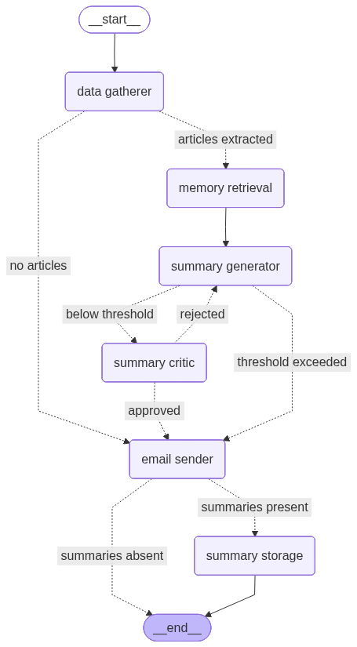

## Overview
This project implements a sequential multi-agent workflow that generates and emails a daily financial news digest, summarizing the top five most significant developments in finance, markets, and the global economy.

Key features include:

**Prompt-chaining:** Decomposes the task into modular stages (retrieval, summarization, feedback) where multiple LLM collaborate to produce high-quality summaries.

**Finite Reflection Loop (LLM-as-a-Judge):** Uses an LLM to iteratively score and suggests improvement, ensuring accuracy, completeness, and clarity while preventing unbounded generate–critic cycles.

**Deduplication:** Ensures daily summaries remain novel by checking against historical records stored in a persistent database.

**Failure Handling:** Automatically sends fallback emails when summary generation fails, maintaining consistent user communication.

**Observability with LangFuse:** Provides end-to-end tracing, cost tracking, latency monitoring, and support for offline evaluation across all workflow nodes.

Note: [Claude AI](https://claude.ai) was used to help with the coding.

## Tech Stack
**Workflow:** LangGraph, Ollama, sentence-transformers, feedparser, trafilatura, smtplib

**Configuration Management:** Hydra and pydantic

**LLM Observability:** LangFuse

**Vector Database:** ChromaDB

## Workflow
<figure>
  
  <figcaption align="center"><i>Figure 1: Workflow diagram with conditional edges logic.</i></figcaption>
</figure>

 
This workflow orchestrates a sequence of specialized nodes for article extraction, memory retrieval, summary generation, quality review and email sending to generate and email a daily financial news digest. The graph uses conditional edges to handle missing data, failed generations, and bounds the reflection loop.

### 1) data gatherer
Extract the raw texts of recent financial news articles from predefined RSS feeds within the last 24 hours, capped at a maximum number of articles.

### 2) memory retrieval
Retrieve past summaries from the persistent summmary database within a lookback range that exceed a pairwise semantic similarity threshold with articles extracted from `data gatherer` to avoid duplicate content.

### 3) summary generator
Using the raw texts from `data gatherer`, the past summaries extracted from `memory retrieval` and any feedback (can be absent) from `summary critic`, summary-generator LLM selects the top 5 significant articles and writes a accurate and clear summary for each article, ensuring that it contains all key information from the source.

### 4) summary critic
Each summary from `summary generator` is evaluated by the summary-critic LLM using a set of evaluation metric (groundedness, relevance, completeness and clarity) and provide comments to correct the errors made. The evaluation scores are then past through a deterministic approver function to determine whether the summaries are approved or not.

Summaries are only approved when all summaries are understandable without ambiguity, factually accurate and covers all key information in the source. If summaries are not approved, regenerate summaries using `summary generator`. This iterative generator-critic loop will end when the summaries are approved or when the loop limit is reached

### 5) email sender
Email summaries to the user via SMTP using a template. If no news articles are extracted or no valid summaries exist, send a default notification.

### 6) summary storage
Store summaries in the persistent summary database for future retrieval.

## LLM Model Selection
- The system uses `Ollama` for self-hosting models, therefore, selected models must fit within an 8 GB VRAM limit, including overhead.
- Tasks involve long, detailed system prompts with multi-step instructions, strict numerical constraints, and structured outputs. Models must have strong instruction-following capabilities.

### Summary Generator LLM
- Requires a large context window to handle multiple long news articles and historical summaries without truncation.
- Needs strong reasoning ability to assess article importance and rank them accordingly.
- Capable of generating clear, accurate summaries that capture all key information from the source.
- Should support iterative refinement, including incorporating feedback and correcting errors.

### Summary Critic LLM
- Acts as an LLM-as-a-judge to compare generated summaries against original articles.
- Able to identify hallucinations, missing key information, and inclusion of unsupported external content.
- Provides actionable feedback to improve summary quality.
- Requires strong semantic understanding to evaluate factual consistency, fluency, and readability.

## LLM System Prompt
- Outputs must follow a structured schema, validated using Pydantic models, to ensure reliability and reduce downstream execution errors.
- One-shot prompting is used, with a detailed example and explanation to enforce correct JSON formatting for parsing into Pydantic models.

### Summary Generator LLM
- Uses chain-of-thought prompting to break the task into steps:
1) Analyze and rank all articles by significance.
2) Select the top five articles.
3) Generate summaries for each selected article.

- Provides explicit criteria defining “significant news” and outlines required elements of a high-quality summary to guide LLM to rank articles and write great summaries.

### Summary Critic LLM
- Defines evaluation metrics clearly, including detailed rubrics, scoring scales and explanations for each score range to guide consistent and reliable evaluation.
